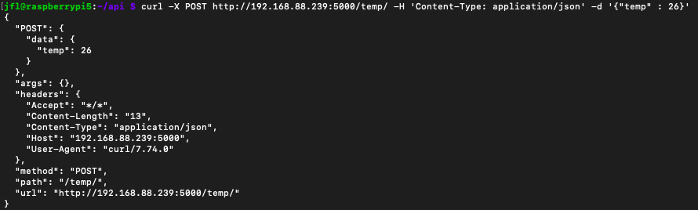

_# Tp bus et réseaux – Castellani Vallery

## Table des matières

- [Introduction](#introduction)
- [Configuration du microcontrôleur](#Configuration-du-microcontrôleur)
- [TP1 - Bus I2C](#TP1---bus-i2c)
- [TP2 - Interfaçage STM32 - Raspberry](#tp2---interfaçage-stm32---raspberry)
- [TP3 - Interface REST](#TP3---interface-REST)
- [TP4 - Bus CAN](#TP4---Bus-CAN)
- [TP5 - Integration I2C - Serial - REST - CAN](#TP5---integration-i2c---Serial---REST---CAN)
- [Conclusion](#conclusion)

## Introduction

Ces différents TPs nous ont permis de réaliser : 
- Une liaison I²C entre la STM32 Nucleo et un capteur de pression et de température
- Une liaison UART entre la STM32 et un Raspberry Pi
- Une interface Web sur le Raspberry Pi
- Une liaison CAN entre la STM32 et une carte pilotant un moteur pas à pas


## Configuration du microcontrôleur 

Dans cette partie nous détaillerons la configuration du microcontrôleur utilisée tout au long du projet.
### Horloge
L'horloge (HCLK) du microcontrôleur provient du HSE et est configurée à 80 Mhz. Les autres paramètres concernant la configuration des horloges sont inchangés.

### Bus I2C
Le bus I2C utilisé est le bus I2C 2. Nous utilisons la broche PB10 pour le signal d'horloge (SCL) et PC12 pour les données (SDA). Tous les paramètres sont les paramètres par défaut et aucune interruption n'est autorisée.

### Communications série
* L'USART 1 est utilisée pour communiquer avec le Raspberry Pi à 115200 bit/s. Les interruptions sont autorisées. Les broches utilisées sont PA9(TX) et PA10(RX).
* L'USART 2 est utilisée pour communiquer avec l'ordinateur à 115200 bit/s. Le printf y est redirigé. Les broches utilisées sont PA2(TX) et PA3(RX).

### Communication CAN
Nous utilisons l'interface CAN 1 du microcontrôleur sur les broches PB8(CAN RX) et PB9(CAN TX). La configuration de cette interface est la suivante :
* Prescaler (for time Quantum)			16
* Time Quante in bit segment 1			2 times
* Time Quanta in bit segment 2			2 times
* Baud rate					500 kbit/s

Les autres paramètres sont inchangés.

## TP1 - Bus I2C

Dans ce premier TP nous cherchons à mettre en place une communication I²C entre entre le microcontrôleur et deux composants I²C. Le microncontrôleur STM32 joue le rôle de maître sur le bus.

### Capteur BMP280
La capteur BMP280 est un capteur de température et de pression. Ces deux grandeurs sont mesurées par deux composants I²C distincts.

### Librairie pour le BMP280

Nous avons divisé cette librairie en deux fichiers : BMP280.c et BMP280.h

__1. Identification du BMP280__

La fonction suivante permet de tester la communication I2C en envoyant l'adresse du registre ID et en lisant le contenu de celui ci. De plus, nous connaissons à l'avance la valeure contenue dans le registre ID (d'après la documentation) et donc nous sommes à priori en mesure de verifier le bon fonctionnement de la communication.

```c
uint8_t BMP280_getId(){
	uint8_t id_register = (uint8_t)ID;
	uint8_t id_rx_value;
	if(HAL_OK == HAL_I2C_Master_Transmit(&hi2c1, BMP_I2C_ADD, &id_register, 1, HAL_MAX_DELAY)){
		if(HAL_OK == HAL_I2C_Master_Receive(&hi2c1, BMP_I2C_ADD, &id_rx_value, 1, HAL_MAX_DELAY)){

		}
	}
	return id_rx_value;
}
```
__2. Configuration du BMP280__

Pour configurer le BMP280 en "mode normal", nous devons envoyer deux octets. Le premier contenant l'adresse du registre à modifier ici CTRL_MEAS et le second contenant la valeur que l'on veut écrire. On créé un tableau de 2 éléments contenant ces octects et nous les envoyons à l'aide de la fonction HAL_I2C_Master_Transmit.<br/>
Nous venons ensuite lire la valeur contenue dans le registre que nous venons de modifier afin de vérifier que le processus d'écriture s'est correctement déroulé. La foncion BMP280_config effectue les actions décrites précédemment.
<br/>
Nous noterons une particularité de l'I2C. En effet, pour lire un registre, il faut d'abord écrire sur le bus l'adresse du registre que nous voulons lire afin de positionner la "tête de lecture" et enfin lire la valeur sur le bus à l'aide de HAL_I2C_Master_Receive.<br/>
En revanche, l'écriture se fait en transmettant l'adresse du registre ou l'on veut écrire puis la valeur que l'on veut y mettre.

```c
uint8_t BMP280_config(){
	uint8_t ctrl_meas_register = (uint8_t)CTRL_MEAS;
	uint8_t ctrl_meas_init_value = 0b01010111;

	uint8_t tx_frame[2] = {ctrl_meas_register, ctrl_meas_init_value};
	uint8_t ctrl_meas_rx_value;

	if(HAL_OK == HAL_I2C_Master_Transmit(&hi2c1, BMP_I2C_ADD, tx_frame, 2, HAL_MAX_DELAY)){
		if(HAL_OK == HAL_I2C_Master_Transmit(&hi2c1, BMP_I2C_ADD, &ctrl_meas_register, 1, HAL_MAX_DELAY)){
			if(HAL_OK == HAL_I2C_Master_Receive(&hi2c1, BMP_I2C_ADD, &ctrl_meas_rx_value, 1, HAL_MAX_DELAY)){

			}
		}
	}
	return ctrl_meas_rx_value;
}
```


__3.Récupération de l'étalonnage__

Avec cette fonction nous récupèrons les données d'étalonnage du capteur BMP280. Ces données vont nous permettre de calculer la température et la pression compensées. Nous recevons les 26 octets de l'étalonnage bien que nous ne les utiliserons pas tous dans la suite.<br/>
```c
uint8_t BMP280_Etalonnage(uint8_t* calibration){
	uint8_t etalonnage_register = (uint8_t)CALIB_TEMP_START;
	for (int i = 0; i<26; i++){
		if(HAL_OK == HAL_I2C_Master_Transmit(&hi2c1, BMP_I2C_ADD, &etalonnage_register, 1, HAL_MAX_DELAY)){
			if(HAL_OK == HAL_I2C_Master_Receive(&hi2c1, BMP_I2C_ADD, &calibration, 26, HAL_MAX_DELAY)){

			}
		}
	}
	return 0;
}
```

__4.Récupération de la température et de la température compensée__

La fonction ci dessous permet de récupérer les données de température sur 3 octets. Les données sont remise en forme afin d'obtenir une valeur exploitable.

```c
uint32_t BMP280_readRawTemp(){
	uint8_t temp_msb_register = (uint8_t)TEMP_MSB;
	uint8_t temp_frame_rx[3] = {0};

	if(HAL_OK == HAL_I2C_Master_Transmit(&hi2c2, BMP_I2C_ADD, &temp_msb_register, 1, HAL_MAX_DELAY)){
		if(HAL_OK == HAL_I2C_Master_Receive(&hi2c2, BMP_I2C_ADD, temp_frame_rx, 3, HAL_MAX_DELAY)){

		}
	}
	return (temp_frame_rx[0]<<12) | (temp_frame_rx[1]<<4) | (temp_frame_rx[2]>>4);
}
```
Dans cette seconde fonction, nous récupèrons les 6 octets d'etalonnage que nous allons utiliser pour calculer la température compensée. Enfin, nous appelons la fonction ci-dessous (fournie dans la documentation du BMP280 pour calculer cette valeur).

```c
uint32_t BMP280_compensateTemp(uint8_t *calib, uint32_t rawTemp){
	uint32_t dig_T1 = calib[0] | calib[1]<<8;
	uint32_t dig_T2 = calib[2] | calib[3]<<8;
	uint32_t dig_T3	= calib[4] | calib[5]<<8;

	uint32_t var1 = ((((rawTemp >> 3) - (dig_T1 << 1)))
			* dig_T2) >> 11;
	uint32_t var2 = (((((rawTemp >> 4) - dig_T1)
			* ((rawTemp >> 4) - dig_T1)) >> 12)
			* dig_T3) >> 14;

	uint32_t t_fine = var1 + var2;

	return (t_fine * 5 + 128) >> 8;
}
```
Enfin, nous appliquons cette compensation à la température brute avec la fonction suivante et nous retournons la température compensée en dégrés.
```c
float BMP280_readCompensateTemp(){
	uint8_t temp_msb_register = (uint8_t)TEMP_MSB;
	uint32_t rawTemp = BMP280_readRawTemp();

	uint8_t tempArray[6] = {0};
	temp_msb_register = (uint8_t)CALIB_TEMP_START;

	if(HAL_OK == HAL_I2C_Master_Transmit(&hi2c2, BMP_I2C_ADD, &temp_msb_register, 1, HAL_MAX_DELAY)){
		if(HAL_OK == HAL_I2C_Master_Receive(&hi2c2, BMP_I2C_ADD, tempArray, 6, HAL_MAX_DELAY)){

		}
	}
	return (float)BMP280_compensateTemp(tempArray, rawTemp)/100;
}
```


__5.Récupération de la pression compensée__

Même principe pour obtenir la pression compensée sauf qu'il faut récupérer dans ce cas les 18 octets d'étalonnage. Ces fonctions s'en occupent :

```c
uint32_t BMP280_readRawPress(){
	uint8_t press_frame_rx[3] = {0};
	uint8_t press_msb_register = (uint8_t)PRESS_MSB;

	if(HAL_OK == HAL_I2C_Master_Transmit(&hi2c2, BMP_I2C_ADD, &press_msb_register, 1, HAL_MAX_DELAY)){
		if(HAL_OK == HAL_I2C_Master_Receive(&hi2c2, BMP_I2C_ADD, press_frame_rx, 3, HAL_MAX_DELAY)){

		}
	}

	return (press_frame_rx[0]<<12) | (press_frame_rx[1]<<4) | (press_frame_rx[2]>>4);
}
```

```c
uint32_t BMP280_compensatePress(uint8_t *calib, uint32_t rawPress) {
	uint32_t dig_P1 = calib[0] | calib[1]<<8;
	uint32_t dig_P2 = calib[2] | calib[3]<<8;
	uint32_t dig_P3	= calib[4] | calib[5]<<8;
	uint32_t dig_P4	= calib[6] | calib[7]<<8;
	uint32_t dig_P5	= calib[8] | calib[9]<<8;
	uint32_t dig_P6	= calib[10] | calib[11]<<8;
	uint32_t dig_P7	= calib[12] | calib[13]<<8;
	uint32_t dig_P8	= calib[14] | calib[15]<<8;
	uint32_t dig_P9	= calib[16] | calib[17]<<8;

	uint32_t t_fine = 0;
	uint64_t var1, var2, p;

	var1 = ((uint64_t)t_fine) - 128000;
	var2 = var1 * var1 * (uint64_t)dig_P6;
	var2 = var2 + ((var1*(uint64_t)dig_P5)<<17);
	var2 = var2 + (((uint64_t)dig_P4)<<35);
	var1 = ((var1 * var1 * (uint64_t)dig_P3)>>8) + ((var1 * (uint64_t)dig_P2)<<12);
	var1 = (((((uint64_t)1)<<47)+var1))*((uint64_t)dig_P1)>>33;
	if(var1 == 0) {
		return 0;
	}
	p = 1048576-rawPress;
	p = (((p<<31)-var2)*3125)/var1;
	var1 = (((uint64_t)dig_P9) * (p>>13) * (p>>13)) >> 25;
	var2 = (((uint64_t)dig_P8) * p) >> 19;
	p = ((p + var1 + var2) >> 8) + (((uint64_t)dig_P7)<<4);
	return (uint32_t)p;
}
```

```c
float BMP280_readCompensatePress(){
	uint8_t press_msb_register = (uint8_t)PRESS_MSB;
	uint32_t rawPress = BMP280_readRawPress();

	uint8_t pressArray[18] = {0};
	press_msb_register = (uint8_t)CALIB_PRESS_START;

	if(HAL_OK == HAL_I2C_Master_Transmit(&hi2c2, BMP_I2C_ADD, &press_msb_register, 1, HAL_MAX_DELAY)){
		if(HAL_OK == HAL_I2C_Master_Receive(&hi2c2, BMP_I2C_ADD, pressArray, 6, HAL_MAX_DELAY)){

		}
	}

	return BMP280_compensatePress(pressArray, rawPress)/256.0;
}
```
## TP2 - Interfaçage STM32 - Raspberry

Dans ce second TP, nous avons dû mettre en place une liaison série entre la STM32 et le Raspberry Pi. Pour permettre la communication entre ces deux machines, nous avons devellopé un shell sur la STM32.

### Shell sur STM32

__1. Initialisation du shell__

Tout d'abord, nous commençons par configurer l'UART1 à 115200 bauds en autorisant les interruptions. Nous écrivons le code relatif au shell dans deux fichiers séparés s'appelant shell.c et shell.h. Nous autorisons la réception de caractères et le déclenchement d'interruptions en appelant la fonction suivante juste avant d'entrer dans la boucle infinie.
```c
void shell_startRxIt(){
	HAL_UART_Receive_IT(&huart1, (uint8_t*) &lastChar, 1);
}
```

__2. Réception d'une commande__

Quand nous recevons un caractère, une interruption est generée et la fonction callback suivante est appelée :
```c
void HAL_UART_RxCpltCallback(UART_HandleTypeDef* huart){
	if(huart->Instance == USART1){
		HAL_UART_Receive_IT(&huart1, (uint8_t*) &lastChar, 1);
		shell_charReceived(lastChar);
	}
}
```
Nous traitons alors le caractère fraichement reçu de la manière suivante :
```c
void shell_charReceived(char charReceived) {
	if(charReceived != '\r' || indexBuff < BUFF_SIZE){
		HAL_UART_Transmit(&huart1, (uint8_t*) &charReceived, 1, HAL_MAX_DELAY);
		charBuffer[indexBuff] = charReceived;
	} else {
		indexBuff = 0;
		
		shell_execute(charBuffer);
		shell_clearBuffer(charBuffer, BUFF_SIZE);
	}
}
```
Un buffer nommé charBuffer a été defini en amont et est de taille BUFF_SIZE.
Nous traitons les données reçues de la manière suivante :
* Si le caractère reçu n'est pas un caractère de retour à la ligne et que le buffer n'est pas plein alors nous stockons le caractère dans un buffer. Nous retournons ce caractère à l'emetteur afin qu'il s'affiche dans le shell. Nous attendons ensuit ele prochian caractère.
* Sinon, nous executons la commande se trouvant dans le buffer et nous remettons tous les caractères du buffer à '\0'.

__3.  Execution d'une commande__

Une fois la commande entrée par l'utilisateur nous executons cette commande à l'aide de la fonction :
```c
void shell_executeCmd(char* cmd){
	int selectedCmd = -1;

	for(int i = 0; tabCmd[i]; i++) {
		if(!strcmp(charBuffer, tabCmd[i])){
			selectedCmd = i;
		}
	}

	switch(selectedCmd){
	case 0 :
		//Call the corresponding function
		printf("GET_T command has been used!\r\n");
		break;
	case 1 :
		//Call the corresponding function
		printf("GET_P command has been used!\r\n");
		break;
	case 2 :
		//Call the corresponding function
		printf("SET_K command has been used!\r\n");
		break;
	case 3 :
		//Call the corresponding function
		printf("GET_K command has been used!\r\n");
		break;
	case 4 :
		//Call the corresponding function
		printf("GET_A command has been used!\r\n");
		break;
	default :
		printf("Unknown command has been called!\r\n");
	}
}
```
Cette fonction compare la commande saisie par l'utilisateur avec les commandes implémentées dans le système. Ces commandes sont stockées dans une table comme suit :
```c
const char *tabCmd[]= {
		"GET_T",
		"GET_P",
		"SET_K",
		"GET_K",
		"GET_A"
};
```
Si la commande existe alors la fonction associée à la commande est appelée, sinon un message d'erreur est renvoyé à l'utilisateur.

### UART avec Python sur Raspberry Pi
La communication entre la STM32 et le RaspberryPi fonctionne de la même manière sauf que les requêtes ne sont plus entrées par un utilisateur mais par le RaspberryPi.
Nous implementons les commandes suivantes dans la STM32.

| __Requête du RPI__ 	| __Réponse du STM__ 	| __Commentaire__ 				|
| --- 			| --- 			| --- 						|
| GET_T 		| T=+12.50_C 		| Température compensée sur 10 caractères 	|
| GET_P 		| P=102300Pa 		| Pression compensée sur 10 caractères 		|
| SET_K=1234 		| SET_K=OK 		| Fixe le coefficient K (en 1/100e) 		|
| GET_K 		| K=12.34000 		| Coefficient K sur 10 caractères 		|
| GET_A 		| A=125.7000 		| Angle sur 10 caractères 			|

Enfin, nous utilisons le programme test suivant sur le RaspberryPi pour faire des requêtes au STM32. La manière dont nous avons devellopé notre shell sur la STM32 nous impose de placer un caractère '\r' en fin de chaine afin de signifier la fin de la commande.

```python
import serial

uart = serial.Serial('/dev/ttyAMA0',115200)

input = input()

if input == 'GET_T':
       uart.write(b"GET_T\r")
if input == 'GET_P':
       uart.write(b'GET_P\r')
if input == 'SET_K':
       val = input()
       uart.write(b'SET_K='+val+'\r')
if input == 'GET_K':
       uart.write(b'GET_K\r')
if input == 'GET_A':
       uart.write(b'GET_A\r')

r = uart.read(50)
```

## TP3 - Interface REST

A l'aide de la bibiothèque Flask, nous avons développé notre serveur web sur la Raspberry Pi 0.
Ce serveur doit faire ses réponses au format JSON et traiter les différentes méthodes HTTP.

Durant ce TP, nous avons travaillé sur la chaîne de caractères suivante : 
```python
welcome = "Welcome to 3ESE API!"
```
### Méthode POST

```python
@app.route('/api/request/', methods=['GET', 'POST'])
@app.route('/api/request/<path>', methods=['GET','POST'])
def api_request(path=None):
    resp = {
            "method":   request.method,
            "url" :  request.url,
            "path" : path,
            "args": request.args,
            "headers": dict(request.headers),
    }
    if request.method == 'POST':
        resp["POST"] = {
                "data" : request.get_json(),
                }
    return jsonify(resp)
```
    
L'objectif étant d'avoir une réponse qui remplisse les champs args et data.

Pour cela, on va utiliser la ligne de commande suivante : 

```
curl -X POST -H 'Content-Type: application/json' http://192.168.88.214:5000/api/request/ -d '{"name": "Lucas"}'
```
Voici la réponse sur la console : 

```
"POST": {
    "data": {
      "Name": "Lucas"
    }
  },
  "args": {},
  "headers": {
    "Accept": "*/*",
    "Content-Length": "18",
    "Content-Type": "application/json",
    "Host": "192.168.88.239:5000",
    "User-Agent": "curl/7.74.0"
  },
  "method": "POST",
  "path": null,
  "url": "http://192.168.88.239:5000/api/request"
  ```

### API CRUD

Nous avons implémenté l'API CRUD suivante : 

| __CRUD__ | __Method__ | __Path__ | __Action__ |
| --- | --- | --- | --- |
| Create | POST | welcome/ | Change sentence |
| Retrieve | GET | welcome/ | Return sentence |
| Retrieve | GET | welcome/x | Return letter x |
| Update | PUT | welcome/x | Insert new word at position x |
| Update | PATCH | welcome/x | Change letter at position x |
| Delete | DELETE | welcome/x | Delete letter at position x |
| Delete | DELETE | welcome/ | Delete sentence |

```python
@app.route('/api/welcome/', methods=['GET'])
def api_welcome():
        return welcome
```
On retourne ici la chaîne de caractères en totalité.

```python
@app.route('/api/welcome/<int:index>', methods=['GET'])
def api_welcome_index(index):
        if index > len(welcome):
                abort(404)
        else:
                return jsonify({"index": index, "val": welcome[index]})
```

Cette fonction nous permet de retourner la lettre à la position index du mot welcome sous le format JSON. Si cet index est supérieur à la longueur du mot, on renvoie sur une page signalant une erreur 404.

```python
@app.route('/api/welcome/<int:index>', methods=['PATCH'])
def api_welcome_patch_index(index):
        global welcome
        data = request.get_json()
        if index >len(welcome) or len(data) != 1 :
                abort(404)
        else :
                temp = list(welcome)
                temp[index] = data
                welcome = "".join(temp)
                return welcome + "\r\n"
```
Cette fonction a pour but de remplacer un caractère de la chaîne welcome à la position index. Si l'index est supérieur à la longueur du mot ou que la data n'est pas une lettre, on renvoie sur une erreur 404. Si ce n'est pas le cas, on transforme la chaîne welcome en liste afin de lui affecter data en position index. Enfin, on utilise "".join(temp) pour avoir notre welcome modifié.

```python
@app.route('/api/welcome/<int:index>', methods=['DELETE'])
def api_welcome_delete_index(index):
        global welcome
        if index > len(welcome):
                abort(404)
        else :
                temp = list(welcome)
                temp.pop(index)
                welcome = "".join(temp)
                return welcome + "\r\n"
```

Ci-dessus, on supprime le caractère index de welcome en utilisant la méthode pop pour une liste.

```python
@app.route('/api/welcome/', methods=['DELETE'])
def api_welcome_delete():
        global welcome
        welcome = ""
        return welcome + "\r\n"
```
Pour supprimer la totalité de la chaîne, il suffit de renvoyer un caractère vide.

```python
@app.route('/api/welcome/', methods=['POST'])
def api_welcome_post():
        global welcome
        if request.method == 'POST':
                welcome = request.get_json()
        return welcome + "\r\n"
```
Lorsque l'on a supprimé la chaîne, on la recréé grâce à la méthode POST. Si la requête est un POST, alors welcome prend comme valeur la chaîne que l'on écrite en donnée.

### Réponse d'une requette GET
```
 "args": {},
  "headers": {
    "Accept": "*/*",
    "Host": "192.168.88.239:5000",
    "User-Agent": "curl/7.74.0"
  },
  "method": "GET",
  "path": null,
  "url": "http://192.168.88.239:5000/api/request"
```

### Réponse d'une requette post 
```
"POST": {
    "data": {
      "Name": "Lucas"
    }
  },
  "args": {},
  "headers": {
    "Accept": "*/*",
    "Content-Length": "18",
    "Content-Type": "application/json",
    "Host": "192.168.88.239:5000",
    "User-Agent": "curl/7.74.0"
  },
  "method": "POST",
  "path": null,
  "url": "http://192.168.88.239:5000/api/request"
  ```
  
  ## TP4 - Bus CAN
  
Les cartes STM32L476 sont équipées d'un contrôleur CAN intégré. Pour pouvoir les utiliser, il faut leur adjoindre un Tranceiver CAN. Ce rôle est dévolu à un TJA1050. Ce composant est alimenté en 5V, mais possède des E/S compatibles 3,3V.
Afin de faciliter sa mise en œuvre, ce composant a été installé sur une carte fille (shield) au format Arduino, qui peut donc s'insérer sur les cartes nucleo64.

Pour ce TP, nous allons utiliser le bus CAN pour piloter le moteur pas à pas.
Nous avons donc rajouté le périphérique CAN1 avec une vitesse d'exactement 500kbit/s dans notre projet sur les broches PB8 (RX) et PB9 (TX). Pour cela, il a fallu changer de bus I2C, nous sommes passé de I2C1 à I2C2.

De la même façon que pour les TPs précédents, nous avons créé pour le contrôle du moteur pas à pas : stepper.c et stepper.h.
  
  __1. Initialisation de la structure__
  
Voici ci-dessous notre structure pour le stepper : elle contient la référence de notre contrôleur CAN et le coefficient de proportionnalité K. 
  
```c
typedef struct stepper_struct{
	CAN_HandleTypeDef* canHandler;
	uint16_t K;
}stepper_t;
```
Nous l'initialisons et activons le contrôleur CAN.

```c
uint8_t stepper_CanInit(stepper_t* stepper, CAN_HandleTypeDef * hcan){
	stepper->canHandler = hcan;
	stepper->K = 10;
	if (HAL_OK != HAL_CAN_Start(stepper->canHandler)){
		while(1);
	}
	return 0;
}
```

 __2. Commande d'angle et de vitesse__
 
Pour transmettre un ordre en rotation, nous avons dévéloppé la fonction stepper_WriteAngle().

```c
void stepper_WriteAngleSpeed(stepper_t* stepper, uint8_t angle, uint8_t sign, uint8_t speed){
	CAN_TxHeaderTypeDef pHeader;

	pHeader.StdId = 0x61;
	pHeader.ExtId = 0;
	pHeader.IDE = CAN_ID_STD;
	pHeader.RTR = CAN_RTR_DATA;
	pHeader.DLC = 3;
	pHeader.TransmitGlobalTime = DISABLE;

	uint8_t aData[2] = {angle, sign};

	if(HAL_CAN_AddTxMessage(stepper->canHandler, &pHeader, (uint8_t*)&aData, &pTxMailBox) != HAL_OK){
		Error_Handler();
	}

}
```
Nous avons développé cela grâce à la documentation du moteur pas à pas.
  
| __Function__ | __Arbitration ID__ | __D0__ | __D1__ | __D2__ |
| --- | --- | --- | --- | --- |
| __Manual Mode__ | 0x60 | Rotation : 0x00 --> Anti-Clockwise  0x01 --> Clockwise | Steps 0x01 to OxFF | Speed 0x01 = 1ms  0xFF = 255ms |
| __Angle__ | 0x61 | 0x01 to 0xFF | Angle sign : 0x00 Positive 0x01 Negative | X |
| __Set internal/ Position to 0__ | 0x62 | X | X | X |
  
Cette fonction prend en paramètres la structure, l'angle de rotation, le signe de la rotation et la vitesse de rotation. 
Il faut dans un premier temps construire le header de la trame : 
- StdId : message Id lorsque celui-ci est dans le mode standard, Ox61 pour la commande en angle
- ExtId : message Id lorsque l'on est en mode étendu. Il est donc nul car on est en mode standard.
- IDE : définit si la trame est standard (CAN_ID_STD) ou étendue (CAN_ID_EXT).
- RTR : définit si la trame est du type standard (CAN_RTR_DATA) ou RTR (CAN_RTR_REMOTE).
- DLC : entier représentant la taille des données à transmettre.
- TransmitGlobalTime : dispositif permettant de mesurer les temps de réponse du bus CAN. Le fixer à DISABLE.

Dans la seconde partie de la fonction, on construit un tableau de 2 éléments comprenant l'angle et le sens de rotation. 
Enfin, on envoie notre trame à l'aide de la fonction HAL : HAL_CAN_AddTxMessage().


  ## TP5 - Integration I2C - Serial - REST - CAN
  
  ### Commande du moteur pas à pas en fonction du capteur de température avec le STM32
  
  Tout d'abord, nous devons configurer notre capteur de température, notre shell et notre stepper.
  
  ```c
uint8_t id = BMP280_getId();
printf("id : 0x%x\r\n", id);
uint8_t bmp280_config = BMP280_config();
printf("config : 0x%x\r\n", bmp280_config);

stepper_CanInit(&stepper, &hcan1);
stepper_set0(&stepper);
stepper_setK(&stepper, 1);
  ```
La commande en angle est calculée à partir de la multiplication du coefficient K avec la différence entre la nouvelle température mesurée et la température de la précédente exécution. Le sens de rotation est ensuite défini en fonction du résultat précédent et l'ordre est envoyé avec la fonction stepper_writeAngle() écrite dans le TP précédent.
 
  ```c
  void stepper_displayTemp(stepper_t* stepper, float temp, float zeroOffset){
	uint16_t k = stepper->K;
	uint16_t sign = 0x00;
	float angle = k*(temp-zeroOffset);

	sign = (angle < 0) ? 0x00 : 0x01;

	stepper_writeAngle(stepper, (uint8_t)(abs(angle)), sign);
}
```
  
  ### API REST
  
  Nous avons implémenté l'API suivante : 

| __CRUD__ | __Method__ | __Path__ | __Action__ |
| --- | --- | --- | --- |
| Create | POST | temp/ | Retrieve new temperature |
| Create | POST | pres/ | Retrieve new pressure |
| Retrieve | GET | temp/ | Return all previous temperatures |
| Retrieve | GET | temp/x | Return temperature #x |
| Retrieve | GET | pres/ | Return all previous pressures |
| Retrieve | GET | pres/x | Return pressure #x |
| Retrieve | GET | scale/ | Return scale (K) |
| Retrieve | GET | angle/ | Return angle (temp x scale) |
| Update | POST | scale/x | Change scale (K) for x |
| Delete | DELETE | temp/x | Delete temperature #x |
| Delete | DELETE | pres/x | Delete pressure #x |

Nous avons dans un premier temps réalisé cet API avec un tableau de températures défini :

```python
temp = [0,0,25,0]
```
- GET

```python
@app.route('/temp/', methods=['GET'])
def getTemp():
        list = []
        for index in range(len(temp)):
                list.append({"index":index, "val": temp[index]})
        total = {"all": list}
        return jsonify(total)
```


- POST

```python
@app.route('/temp/', methods=['POST'])
def postTemp(path = '/temp/'):
        resp = {
               "method": request.method,
               "url" :  request.url,
               "path" : path,
               "args": request.args,
               "headers": dict(request.headers),
        }
        if request.method == 'POST':
                resp["POST"] = {
                        "data" : request.get_json(),
                }
                json = request.get_json()
                temp.append(json["temp"])
        return jsonify(resp)
```



- DELETE

```python
@app.route('/temp/<int:index>', methods = ['DELETE'])
def deleteTempIndex(index):
    if (index > len(temp)):
        abort(404)
    else : 
        temp.pop(index)
        return "The data is deleted\r\n"
```


Concernant le coefficient de proportionnalité K et l'angle, nous avons décidé de le fixer arbitrairement afin de réaliser nos tests dessus.
Nous aborderons uniquement le cas de l'angle afin d'éviter les redondances.

- POST

```python
@app.route('/scale/<int:value>', methods = ['POST'])
def postScale(value):
    global K
    if request.method == 'POST':
        K  = value
    return jsonify({"Coeff" : K})

```


- GET 

```python
@app.route('/scale/', methods = ['GET'])
def getScale():
    constante = {"Coefficient de proportionnalite K" : K}
    return jsonify(constante)
```


Enfin, nous avons eu le temps de traiter la communication entre la stm32 et la raspberry. Cependant, uniquement pour le cas où cette dernière demande une température au stm32. 
Pour cela, nous avons dû importer le module serial et déclarer notre liaison uart avec un timeout. Ce timeout ....

```python
import serial
uart = serial.Serial('/dev/ttyAMA0', 115200, timeout=1)
```
Mais aussi modifier la fonction précédemment écrite pour obtenir une température. Nous avons décidé de faire une fonction commune pour la méthode GET et POST.

```python
@app.route('/temp/', methods = ['POST', 'GET'])
def postTemp():
    uart.write(b"GET_T\r")
    temperature = (uart.readline().strip()).decode('ascii')
    temperature = float(temperature)
    temp.append(temperature)
    if request.method == 'POST':
        return "", 202
    return jsonify({"Valeurs temperature" : temperature})
```


## Conclusion

Durant ces 5 séances de TPs, nous avons réussi à : 
- récupérer les données du capteur de température et de pression
- récupérer les données sur le Raspberry par l'intermédiaire de notre shell
- piloter le moteur pas à pas avec le bus CAN
- créer une API REST pour stocker les valeurs

Enfin, nous avons réussi à faire fonctionner tous ces modules ensemble. On a réalisé une requête avec la raspberry qui a demandé à la stm32 et donc au capteur la valeur de la température. Le microprocesseur renvoie la valeur de la température et l'API la stocke dans un tableau. 
Si nous avions eu plus de temps, nous aurions réalisé la même procédure pour l'obtention de la pression et pour le réglage du coefficient de proportionnalité. De plus, il aurait été intéressant de pouvoir automatiser ces requêtes entre la stm32 et la rapsberry afin de supprimer toute intervention humaine dans la chaîne.


